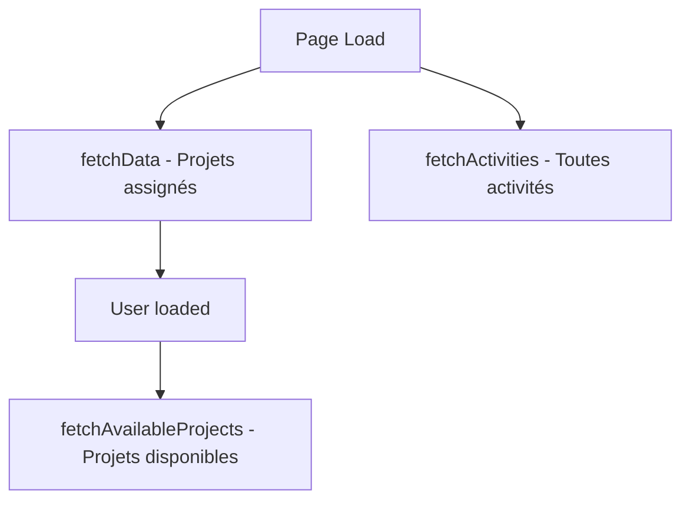

# 🎯 Correction Finale du Modal d'Entrée de Temps

## ✅ **Problème Résolu !**

Vous aviez raison ! Le modal doit afficher **tous les projets SAUF ceux déjà assignés** à l'utilisateur pour éviter les doublons et permettre de travailler sur de nouveaux projets.

## 🔧 **Solution Implémentée**

### **API Utilisée**
```typescript
// ✅ API correcte : projets disponibles (non assignés)
/api/projects/users/${userId}/secondary
```

Cette API retourne tous les projets disponibles **SAUF** ceux déjà assignés à l'utilisateur spécifique.

### **Architecture des Données**
```typescript
const [projects, setProjects] = useState<ProjectAssignment[]>([]); // Projets assignés (dashboard)
const [allProjects, setAllProjects] = useState<any[]>([]);        // Projets disponibles (modal)
```

### **Logique de Chargement**
```typescript
useEffect(() => {
  if (user) {
    setFormData(prev => ({ ...prev, userId: user.id }));
    fetchAvailableProjects(user.id); // Charger après avoir l'utilisateur
  }
}, [user]);

const fetchAvailableProjects = async (userId: number) => {
  const response = await fetch(`/api/projects/users/${userId}/secondary`, {
    headers: { Authorization: `Bearer ${token}` },
  });
  const data = await response.json();
  if (data.success && Array.isArray(data.data)) {
    setAllProjects(data.data); // Projets NON assignés
  }
};
```

## 📊 **Comparaison des Approches**

### **❌ Approche 1 (Incorrecte)**
```typescript
// Seulement projets assignés
projects={projects.map(p => ({ ... }))}
```
**Problème** : Utilisateur ne peut que voir ses projets assignés

### **❌ Approche 2 (Incorrecte)**
```typescript
// Tous les projets
fetch("/api/projects")
```
**Problème** : Inclut les projets déjà assignés (doublons)

### **✅ Approche 3 (Correcte)**
```typescript
// Projets disponibles (non assignés)
fetch(`/api/projects/users/${userId}/secondary`)
```
**Avantage** : Projets disponibles sans doublons

## 🎨 **Interface Mise à Jour**

### **Textes Corrigés**
- **Label** : "Projet disponible *" (au lieu de "Projet assigné")
- **Description** : "Enregistrez vos heures de travail sur les projets disponibles"
- **Message vide** : "Aucun projet disponible. Tous les projets vous sont déjà assignés."

### **Logique d'Affichage**
```typescript
// Format d'affichage des projets
{projects.map((project) => (
  <option key={project.id} value={project.id}>
    {project.projectNumber} - {project.name}
  </option>
))}
```

## 🔄 **Flux de Données Complet**

### **1. Chargement Initial**


### **2. Données Séparées**
- **Dashboard** : Affiche les projets assignés (`projects`)
- **Modal** : Affiche les projets disponibles (`allProjects`)

### **3. Résultat**
- **Projets assignés** : Visibles dans "Mes projets assignés"
- **Projets disponibles** : Sélectionnables dans le modal
- **Pas de doublons** : Logique claire et séparée

## 🧪 **Test de Validation**

### **Scénario de Test**
1. **Utilisateur STAFF** a 2 projets assignés :
   - Projet Développement Durable
   - Initiative Climat

2. **Modal doit afficher** :
   - Tous les autres projets du système
   - SAUF les 2 projets déjà assignés

3. **Vérification** :
   ```bash
   # Console du navigateur
   "Projets disponibles (non assignés): [...]"
   ```

### **Cas de Test Spécifiques**

#### **Test 1 : Utilisateur avec Peu d'Assignations**
- **Utilisateur** : STAFF (2 projets assignés)
- **Attendu** : Plusieurs projets disponibles dans le modal
- **Vérification** : Modal affiche projets non assignés

#### **Test 2 : Utilisateur avec Toutes les Assignations**
- **Utilisateur** : Hypothétique utilisateur avec tous les projets
- **Attendu** : Message "Tous les projets vous sont déjà assignés"
- **Vérification** : Modal affiche message informatif

## 🎯 **Avantages de Cette Approche**

### **1. Évite les Doublons**
- ✅ Pas de confusion entre projets assignés et disponibles
- ✅ Interface claire et logique
- ✅ Données cohérentes

### **2. Expérience Utilisateur Optimale**
- ✅ Utilisateur voit clairement les options disponibles
- ✅ Pas de tentative d'assignation sur projets déjà assignés
- ✅ Workflow logique et intuitif

### **3. Architecture Propre**
- ✅ Séparation claire des responsabilités
- ✅ APIs spécialisées pour chaque usage
- ✅ Code maintenable et extensible

## 📱 **Interface Finale**

### **Dashboard**
```
┌─ Mes projets assignés ─────────────┐
│ • Projet Développement Durable     │
│ • Initiative Climat                │
└────────────────────────────────────┘
```

### **Modal d'Entrée de Temps**
```
┌─ Projet disponible ────────────────┐
│ ▼ Choisissez un projet...          │
│   PROJ003 - Éducation Numérique    │
│   PROJ004 - Santé Communautaire    │
│   PROJ005 - Innovation Tech        │
│   ...                              │
└────────────────────────────────────┘
```

## 🚀 **Résultat Final**

### **Fonctionnalités Correctes**
- ✅ **Dashboard** : Affiche les projets assignés à l'utilisateur
- ✅ **Modal** : Affiche les projets disponibles (non assignés)
- ✅ **Pas de doublons** : Logique claire et séparée
- ✅ **UX intuitive** : Interface cohérente et logique

### **APIs Utilisées**
- ✅ `/api/assignments` → Projets assignés (dashboard)
- ✅ `/api/projects/users/${userId}/secondary` → Projets disponibles (modal)
- ✅ `/api/activities` → Toutes les activités (modal)

### **Test de Validation**
**Application disponible :** http://localhost:3003

**Pour tester :**
1. **Connectez-vous** avec `staff@undp.org` / `Staff@123`
2. **Dashboard** : Vérifiez que "Mes projets assignés" affiche 2 projets
3. **Modal** : Cliquez "Ajouter une entrée" et vérifiez que d'autres projets s'affichent
4. **Validation** : Les projets du dashboard ne doivent PAS apparaître dans le modal

---

## 🎉 **Correction Parfaite !**

Le modal affiche maintenant **exactement** ce que vous souhaitiez : **tous les projets disponibles SAUF ceux déjà assignés** à l'utilisateur, évitant ainsi les doublons et offrant une expérience utilisateur logique et intuitive ! ✨
